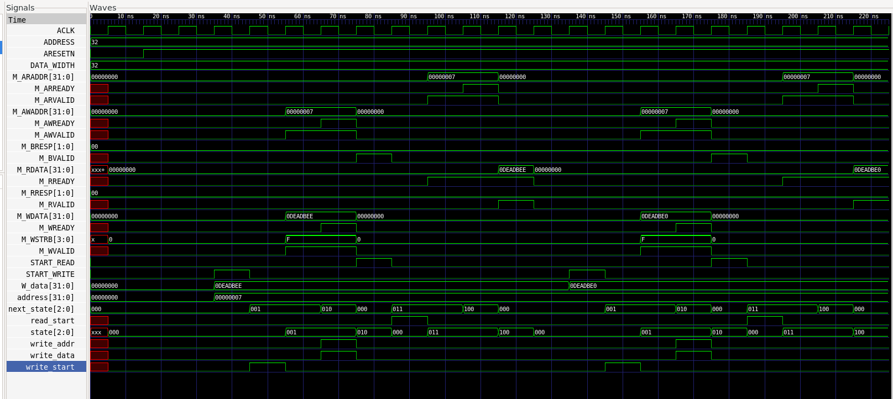

# AXI Lite Verilog Project

This repository contains a Verilog/SystemVerilog implementation and testbench for an **AXI-Lite interface**.  
The design includes a simple **master** and **slave**, along with a top-level design and testbench for simulation.

---

## 📂 Project Structure

```
.
├── axi_lite_master.sv   # AXI-Lite Master implementation
├── axi_lite_slave.sv    # AXI-Lite Slave implementation
├── design.sv            # Top-level design integrating master/slave
├── testbench.sv         # Testbench for simulation
```

---

## 🚀 Simulation

### ▶️ On EDA Playground
This project can be simulated directly on [EDA Playground](https://www.edaplayground.com/).  
Recommended settings:
- **Testbench + Design:** SystemVerilog / Verilog
- **UVM / OVM:** UVM 1.2
- **Tools & Simulators:** Aldec Riviera Pro 2023.04
- **Compile Options:** `-timescale 1ns/1ns`
- **Run Options:** `+access+r`
- **Run Time:** `10 ms`

Make sure to include the following files:
- `axi_lite_master.sv`
- `axi_lite_slave.sv`
- `design.sv`
- `testbench.sv`

---


## Simulation & Waveform

During simulation, the design produces a **VCD (Value Change Dump)** file (`axi4_lite.vcd.vcd`).
You can open this file with any waveform viewer, for example:

- [GTKWave](http://gtkwave.sourceforge.net/) (open-source, cross-platform)
- Integrated viewers in simulators like ModelSim, Questa, or Vivado

This helps visualize the AXI4-Lite transactions (handshakes, read/write data flow).

### Example waveform



## 📝 Notes
- The **master** drives AXI-Lite read/write transactions.  
- The **slave** responds with valid/ready handshakes.  
- `design.sv` connects master and slave for integration testing.  
- `testbench.sv` provides stimulus and monitors outputs.

---

## 📜 License
This project is open source under the MIT License.  
Feel free to use and modify for learning or research purposes.
